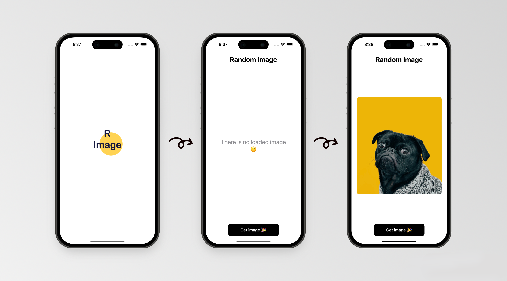

# Random Image

Добро пожаловать в приложение Random Image! Это место, где ты можешь найти потрясающие случайные фотографии животных прямиком с сайта unsplash.com. 

Welcome to the Random Image app! This is the place where you can find amazing random animal pictures straight from unsplash.com.

## Русскоязычная версия

Random Image - твой лучший источник случайных фотографий животных 🐾

### Основные возможности: 🌟

1. Главный экран: Увидеть превью случайной фотографии животного.
2. Просмотр в полном размере: Нажми на превью, и перейди на новый экран. Можно увеличить фотографию, чтобы разглядеть каждую деталь. 
3. Поделиться с друзьями: Потому что c хорошим всегда хочется поделиться! 🚀
4. Сохранить в галерею: Сделай свою коллекцию забавных и милых животных. Можешь установить себе на обои телефона! 📲
5. Скопировать: Не хочешь сохранять? Просто скопируй!

### Использованный стек 🛠:

- SwiftUI: Магия интерфейсов.
- URLSession: Для связи с интернетом.
- API: Наши двери в мир unsplash.com.
- Postman: Наш надежный гонец для работы с API.

### Вид приложения 📱

Нажми и посмотри на youtube:

## The English version

Random Image - your best source of random animal pictures 🐾

### Main features 🌟

1. Main screen: See a preview of a random animal picture.
2. Full-size view: Tap on the preview and go to a new screen! You can zoom in to see every detail. 
3. Share with friends: Because good things are meant to be shared! 🚀
4. Save to gallery: Create your own library of cute and funny animal pictures. You can install it on your phone wallpaper! 📲
5. Copy: Don't want to save? Just copy!

### Stack 🛠:

- SwiftUI: Magic of interfaces.
- URLSession: For internet communication.
- API: Our gateway to unsplash.com.
- Postman: Our reliable messenger for working with the API.

### View Application 📱

Click and watch on youtube:

